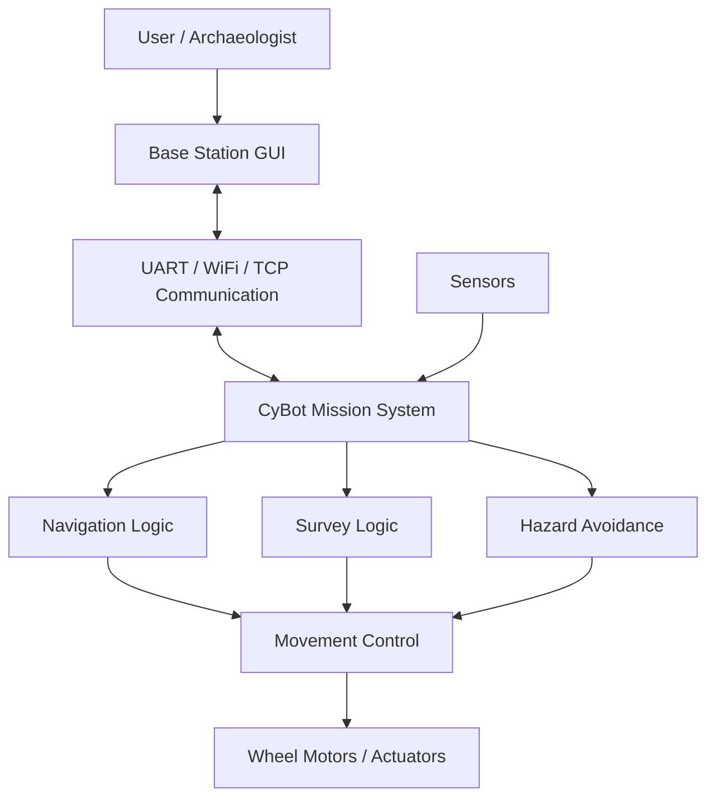
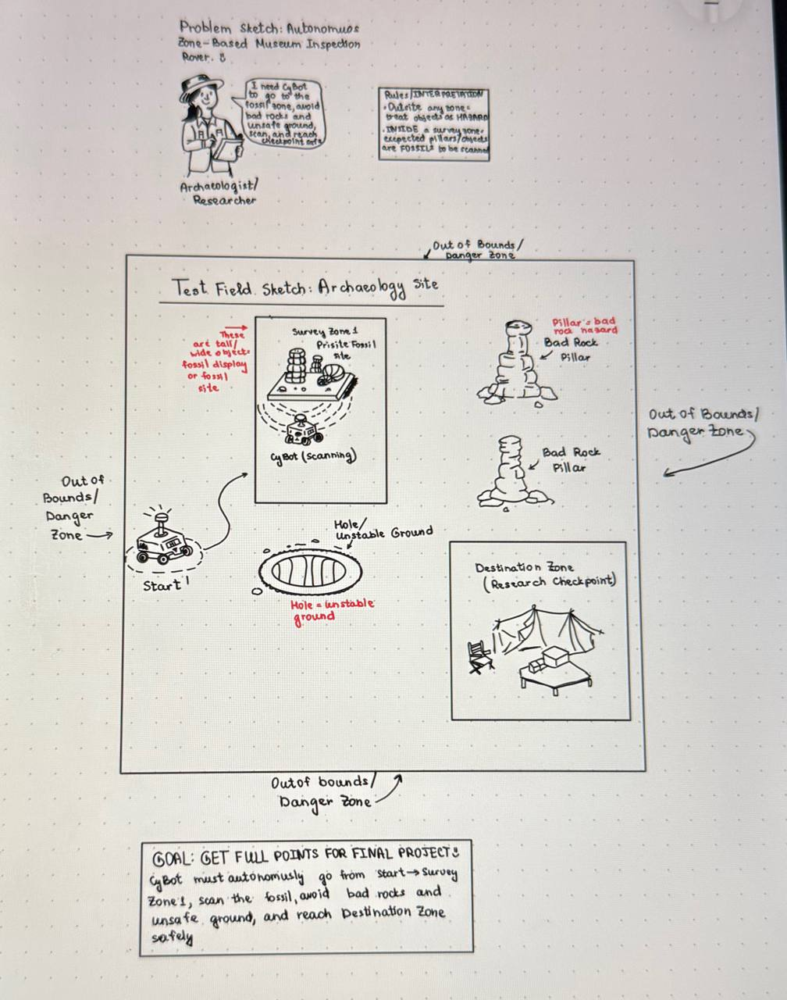
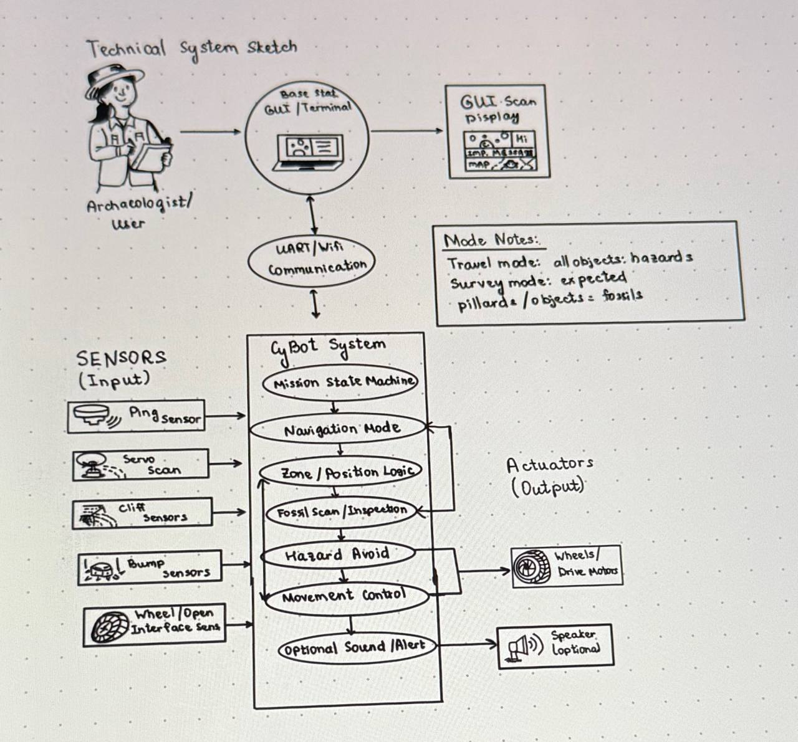
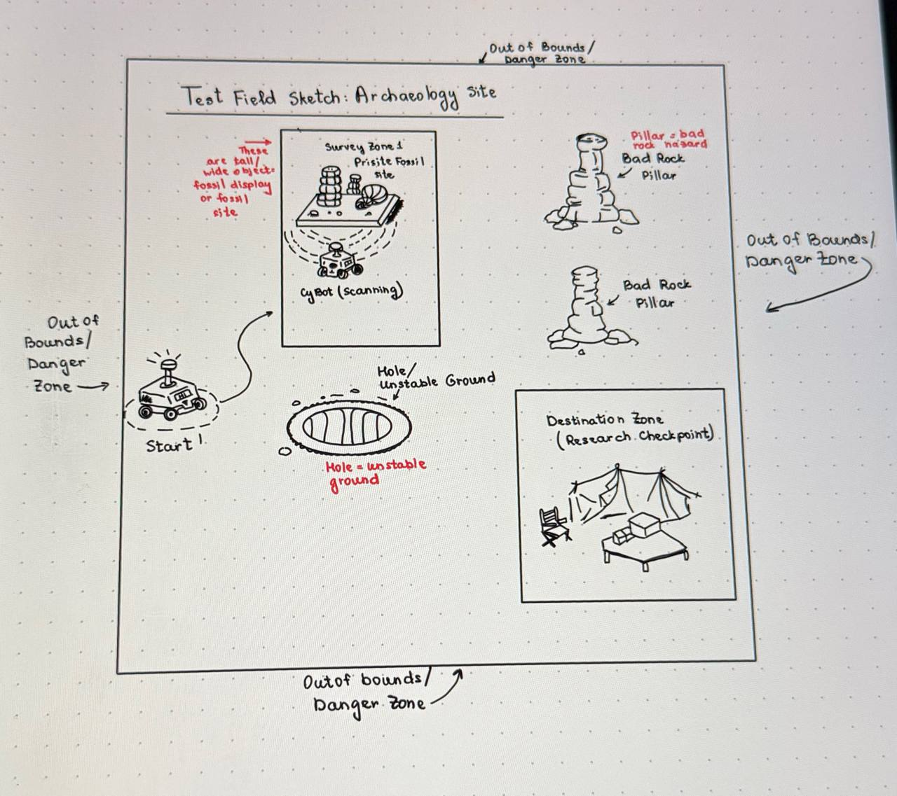

<h1 align="center">🤖 CyBot Archaeology Survey Rover</h1>

<h3 align="center">Embedded Systems • Autonomous Navigation • System Design</h3>

<p align="center">
  <strong>CprE 288 — Embedded Systems | Iowa State University</strong>
</p>

<p align="center">
  An autonomous archaeology-themed rover designed to navigate hazards,
  scan a survey area, communicate with a base station, and reach a research checkpoint.
</p>

<p align="center">
  
  
  
  
</p>

<p align="center">
  
  
  
  
</p>

---

# 🔎 Overview

The **CyBot Archaeology Survey Rover** was developed as a five-person team project for **CprE 288 at Iowa State University**.

The project reimagined the CyBot as a rover operating inside a simulated archaeological excavation site.

The rover was designed to:

- Navigate through a test field
- Detect and avoid obstacles
- Detect unsafe boundaries and holes
- Travel to a survey area
- Scan objects in the environment
- Communicate with a base station
- Reach a final research checkpoint safely

The archaeology theme gave the technical requirements a practical mission involving fragile objects, unsafe terrain, protected areas, and survey targets.

---

# 👩‍💻 My Contributions

My main responsibilities were:

### 🖥️ GUI & Visualization
- Contributed to the design of the rover's base-station interface
- Helped visualize rover status, sensor information, scan data, and mission progress
- Worked with GUI concepts for controlling and monitoring the CyBot

### 🧩 System Design
- Helped map the relationship between sensors, communication, navigation, hazard avoidance, and movement
- Contributed to the technical system architecture and system sketches
- Helped organize rover behavior into logical mission components

### 🧪 Testing
- Supported testing of rover behavior and project requirements
- Helped validate movement, sensing, scanning, safety behavior, and system integration

### 📝 Documentation
- Contributed to the project Statement of Work
- Helped create technical diagrams and system sketches
- Documented functionality, design decisions, implementation planning, and test-field concepts

> This was a team project. The repository describes the overall system while clearly identifying the areas I personally contributed to.

---

# 🎯 Mission

The rover's mission followed a simple sequence:

```text
START
  │
  ▼
Navigate Through Dig Site
  │
  ▼
Detect & Avoid Hazards
  │
  ▼
Reach Survey Zone
  │
  ▼
Scan Survey Area
  │
  ▼
Continue Navigation
  │
  ▼
Reach Research Checkpoint
```

The project included a designated **survey zone** in addition to the required final destination.

---

# 🧠 Operating Modes

The rover design used two main behaviors.

## 🚗 Travel Mode

During normal navigation:

- Objects are treated as possible hazards
- The rover focuses on safe movement
- Boundary and cliff sensors support safety
- Obstacles are avoided when detected

## 🔍 Survey Mode

When the rover reaches the survey zone:

- Normal navigation pauses
- A scan is performed
- Expected objects can be interpreted as survey targets
- Scan information can be sent to the base station

This allowed navigation behavior and survey behavior to be handled separately.

---

# ⚙️ System Architecture



At a high level, the system combines:

**Sensors → Embedded Logic → Navigation / Survey Behavior → Movement → Base Station Feedback**

---

# 📡 Sensors & Embedded Components

The overall team design used several CprE 288 platform components.

| Component | Purpose |
|---|---|
| **Bump Sensors** | Detect physical contact with obstacles |
| **Cliff Sensors** | Detect unsafe ground and boundaries |
| **Ping Sensor** | Measure distance to objects |
| **Servo Motor** | Rotate the sensor during scans |
| **iRobot Open Interface** | Control movement and access robot sensors |
| **UART / WiFi** | Communicate with the base station |
| **PWM** | Support servo control |
| **Input Capture** | Measure ping timing |
| **Interrupts** | Handle responsive events and communication |
| **ADC** | Support analog sensing when needed |

These technologies describe the **overall team system**. My personal work focused mainly on GUI/system design, testing, sketches, and documentation.

---

# 🖥️ Base Station GUI

The project also included work on a Python-based interface for interacting with and monitoring the CyBot.

The GUI concept included capabilities such as:

- Connecting to the CyBot
- Sending movement commands
- Starting and stopping operation
- Requesting scans
- Displaying sensor information
- Monitoring mission progress
- Viewing detected objects
- Displaying rover status
- Viewing communication/debug messages

The interface helped make information from the embedded system easier to understand during testing and demonstrations.

---

# 🗺️ Test Environment

The test field represented an archaeological excavation site.

| Test Element | Archaeology Meaning |
|---|---|
| **Tall Objects** | Large rocks or fossil formations |
| **Short Objects** | Small rocks or debris |
| **Holes** | Unstable excavation ground |
| **Pillars** | Research checkpoint markers |
| **Boundary** | Unsafe excavation perimeter |
| **Survey Zone** | Fossil inspection area |
| **Destination Zone** | Final research checkpoint |

The rover started in one area, navigated through hazards, visited the survey zone, and then continued toward the final destination.

---

# 🚨 Safety & Hazard Avoidance

Safety was an important part of the design.

The system needed to respond to hazards such as:

- Tall obstacles
- Short obstacles
- Holes
- Cliff events
- Boundary crossings
- Incorrect destination positioning

Possible serious incidents included:

```text
Crossing the boundary
Falling into a hole
Hitting tall objects
Repeatedly hitting short objects
Incorrect destination positioning
Program failure
```

The rover's sensor and navigation logic were designed around avoiding these conditions.

---

# 🧪 Testing & Validation

Testing focused on verifying individual behaviors before combining them into the full mission.

### Movement
- Forward motion
- Turning
- Stopping

### Sensors
- Bump detection
- Cliff detection
- Distance sensing
- Scan behavior

### Safety
- Boundary response
- Hole avoidance
- Obstacle response

### Mission Behavior
- Travel Mode
- Survey Mode
- Survey-zone scanning
- Destination behavior

### Integration
- Sensor-to-control behavior
- Communication
- Mission-state transitions
- Requirement verification

---

# 📋 Development Approach

The project was planned in phases:

```text
Phase 1
Manual rover control
        ↓
Phase 2
Bump & cliff sensor feedback
        ↓
Phase 3
Emergency safety response
        ↓
Phase 4
Ping sensor + servo scanning
        ↓
Phase 5
Autonomous travel behavior
        ↓
Phase 6
Survey-zone logic
        ↓
Phase 7
Destination-zone behavior
```

This made it easier to test individual capabilities before full system integration.

---

# 🛠️ Technologies

## Programming


## Embedded Systems


## Engineering


---

# 🖼️ Project Diagrams

## Problem / Mission Sketch

Shows the archaeology mission, user context, rover, hazards, survey zone, and destination.

<p align="center">
  
</p>

---

## Technical System Sketch

Shows the relationship between:

**User → Base Station → Communication → CyBot → Sensors → Navigation → Actuators**

<p align="center">
  
</p>

---

## Test Field Sketch

Shows the planned archaeology environment including:

- Start location
- Survey zone
- Fossil target
- Obstacles
- Hole / unsafe terrain
- Boundary
- Destination checkpoint

<p align="center">
  
</p>

> The images will display after the corresponding files are added to the `assets` folder.

---

# 💡 What I Learned

This project helped me strengthen my understanding of both technical systems and the engineering design process.

### Embedded Systems
- How sensors provide information to software
- How hardware events affect program behavior
- How communication connects embedded hardware to external software

### System Design
- Breaking a large mission into smaller subsystems
- Mapping requirements to technical components
- Thinking about safety and failure conditions

### Testing
- Testing components before integration
- Comparing system behavior against requirements
- Identifying problems during integration

### Technical Communication
- Creating system diagrams
- Documenting design decisions
- Explaining how hardware and software interact

### Teamwork
- Working within a five-person engineering team
- Dividing responsibilities
- Communicating system decisions across different project areas

---

# 📁 Repository Structure

This repository is a cleaned portfolio version of the original course workspace.

```text
cybot-archaeology-survey-rover/
│
├── README.md
│
├── gui/
│   └── selected GUI files
│
├── embedded/
│   └── selected project source files
│
├── docs/
│   └── selected project documentation
│
├── testing/
│   └── testing notes
│
└── assets/
    ├── problem-sketch.png
    ├── technical-system-sketch.png
    ├── test-field-sketch.png
    └── screenshots/
```

---

# 🎓 Academic Context

**Course:** CprE 288 — Embedded Systems  
**University:** Iowa State University  
**Department:** Electrical & Computer Engineering  
**Team Size:** 5  
**Project Type:** Autonomous Embedded Systems Team Project

---

# ⚠️ Attribution

This was a **team engineering project**.

The README describes the overall system so the project can be understood in context.

My primary contributions were:

```text
GUI & Visualization
        +
System Design
        +
Technical Sketches
        +
Testing
        +
Documentation
```

Technologies used elsewhere in the team project should not be interpreted as components I personally implemented unless explicitly stated.

---

# 🔐 Academic Integrity

This repository is a **curated professional portfolio presentation**, not a complete copy of the CprE 288 course workspace.

It intentionally excludes:

- Instructor-provided material
- Unrelated course assignments
- IDE metadata
- Build files
- Compiled binaries
- Temporary files
- Private information
- Student identifiers

---

# 🔗 Connect With Me

<p align="center">

<a href="https://github.com/mubina-s">
  
</a>

<a href="https://www.linkedin.com/in/mubina-sadriddinova-bb889a363/">
  
</a>

<a href="mailto:mubish@iastate.edu">
  
</a>

</p>

---

<p align="center">
  <i>From sensors to systems — designing technology that can understand and respond to the world around it.</i>
</p>
